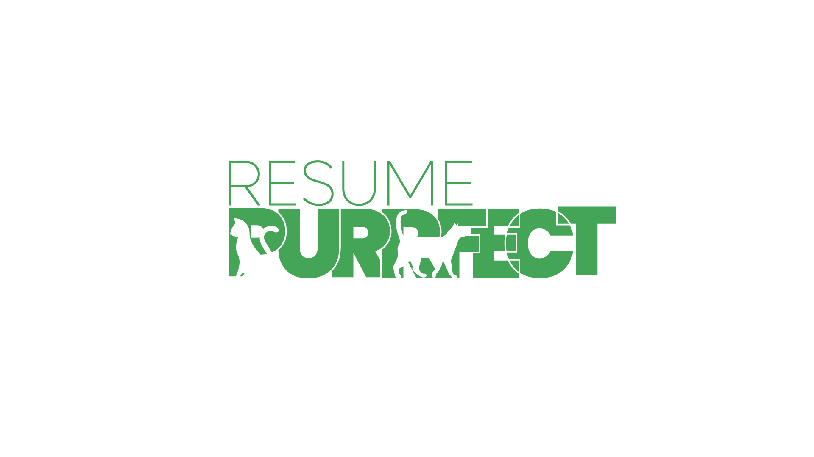

<<<<<<< HEAD

   
    
   
   
  

    
    
    
    
  

  
  <h1 align="center">Resume Purrfect</h1>
  <h3 align="center">Interactive Resume Builder</h3>

   

   Welcome to the Interactive Resume Builder! This project allows users to create,
   customize, and download professional resumes interactively.

 📋<a" name="table">Table of Contents</a>

1. 🤖 [Introduction](#introduction)
2. ⛳ [Demo](#demo)
3. ⚙️ [Tech Stack](#tech-stack)
4. 🔋 [Features](#features)
5. 🔗 [Contact](#contact)
6. 🧾 [License](#license)

## <a name="introduction">🤖 Introduction</a>

This is a Interactive Resume builder I created as part of the GIAIC 24-hours Hackhathon project.

## <a name="demo">⛳ Demo<a/>
You can see the project through <a href="https://resume-purrfect-hackhathon-nabirah-siddiqui.vercel.app">here<a/>

## <a name="tech-stack">⚙️ Tech Stack</a>

- Javascript
- HTML
- Locomotive.js
- GSAP (Greensock)
- CSS 3

## <a name="features">🔋 Features</a>
 

<h1 align="center">Darkmode</h1>

 

 
<li>Darkmode theme and Light mode theme that changes per device's default theme</li>

 
 

<h1>Responsive:</h1>

 
 

  

 

<li>This project is fully responsive and optimized for various screen sizes, from mobile devices to desktop monitors.</li>

 
 

<h1>Interactive Animations using GSAP</h1>
 

  

 
 
<li>Enhanced user experience with seamless and captivating animations powered by GSAP.</li>

 
 

<h1>Interactive Elements:</h1>
 

  

 
 
<li>Add, remove, and edit sections with an intuitive interface.</li>
 
 

<h1>Preview Mode</h1>
 

  

 
 
<li>See real-time updates as you customize your resume</li>
 
 

<h1>Download Option</h1>
 
 

  

 
<li>Export your resume as a PDF.</li>
 
 

## <a name="contact">🔗 Contact</a>

If you have any questions, feel free to reach out:

<ul>
  <li><strong>All links:</strong> <a href="https://linktr.ee/notanyone_07">notanyone_07</a></li>
  <li><strong>GitHub:</strong> <a href="https://github.com/NotAnyone07" target="_blank">NotAnyone07</a></li>
  <li><strong>LinkedIn:</strong> <a href="www.linkedin.com/in/nabirah-siddiqui" target="_blank">Nabirah Siddiqui</a></li>
</ul>

  
## <a name="license"> 🧾 License<a/>

This project is licensed under the GNU General Public License (GPL) License. See the <a href="LICENSE">LICENSE</a> file for details.

<strong>Thank you for visiting my project!</strong> If you found this helpful, please give it a star on GitHub!

#
=======

   
    
   
   
  

    
    
    
    
  

  
  <h1 align="center">Resume Purrfect</h1>
  <h3 align="center">Interactive Resume Builder</h3>

   

   Welcome to the Interactive Resume Builder! This project allows users to create,
   customize, and download professional resumes interactively.

 📋<a" name="table">Table of Contents</a>

1. 🤖 [Introduction](#introduction)
2. ⛳ [Demo](#demo)
3. ⚙️ [Tech Stack](#tech-stack)
4. 🔋 [Features](#features)
5. 🔗 [Contact](#contact)
6. 🧾 [License](#license)

## <a name="introduction">🤖 Introduction</a>

This is a Interactive Resume builder I created as part of the GIAIC 24-hours Hackhathon project.

## <a name="demo">⛳ Demo<a/>
You can see the project through <a href="https://resume-purrfect-hackhathon-nabirah-siddiqui.vercel.app">here<a/>

## <a name="tech-stack">⚙️ Tech Stack</a>

- Javascript
- HTML
- Locomotive.js
- GSAP (Greensock)
- CSS 3

## <a name="features">🔋 Features</a>
 

<h1 align="center">Darkmode</h1>

 

 
<li>Darkmode theme and Light mode theme that changes per device's default theme</li>

 
 

<h1>Responsive:</h1>

 
 

  

 

<li>This project is fully responsive and optimized for various screen sizes, from mobile devices to desktop monitors.</li>

 
 

<h1>Interactive Animations using GSAP</h1>
 

  

 
 
<li>Enhanced user experience with seamless and captivating animations powered by GSAP.</li>

 
 

<h1>Interactive Elements:</h1>
 

  

 
 
<li>Add, remove, and edit sections with an intuitive interface.</li>
 
 

<h1>Preview Mode</h1>
 

  

 
 
<li>See real-time updates as you customize your resume</li>
 
 

<h1>Download Option</h1>
 
 

  

 
<li>Export your resume as a PDF.</li>
 
 

## <a name="contact">🔗 Contact</a>

If you have any questions, feel free to reach out:

<ul>
  <li><strong>All links:</strong> <a href="https://linktr.ee/notanyone_07">notanyone_07</a></li>
  <li><strong>GitHub:</strong> <a href="https://github.com/NotAnyone07" target="_blank">NotAnyone07</a></li>
  <li><strong>LinkedIn:</strong> <a href="www.linkedin.com/in/nabirah-siddiqui" target="_blank">Nabirah Siddiqui</a></li>
</ul>

  
## <a name="license"> 🧾 License<a/>

This project is licensed under the GNU General Public License (GPL) License. See the <a href="LICENSE">LICENSE</a> file for details.

<strong>Thank you for visiting my project!</strong> If you found this helpful, please give it a star on GitHub!

#
>>>>>>> ed4a25b (bugfixes)
